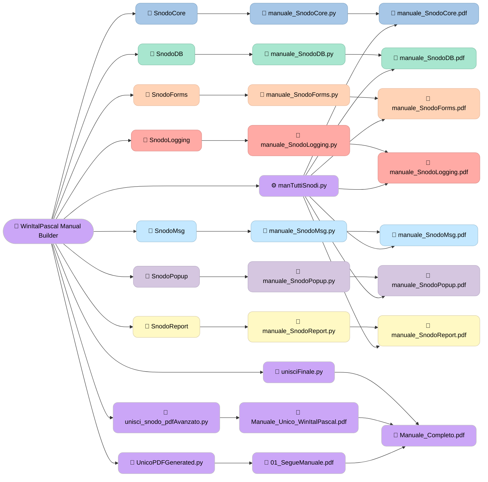

---
<p align="center">
  
</p>

---

<div align="center">
  <strong>📘 WinItalPascal_ManualBuilder</strong>
</div>

<p align="center">

  <a href="https://github.com/List051/WinItalPascal_ManualBuilder">
    
  </a>

  <a href="https://github.com/List051/WinItalPascal_ManualBuilder">
    
  </a>

  <a href="https://github.com/List051/WinItalPascal_ManualBuilder/issues">
    
  </a>

  <a href="https://github.com/List051/WinItalPascal_ManualBuilder/commits/main">
    
  </a>

  <a href="https://github.com/List051/WinItalPascal_ManualBuilder/blob/main/LICENSE">
    
  </a>

</p>

<!-- SEPARATORE -->
<div align="center" style="font-size:28px; margin: 10px 0;">⬤</div>

<!-- ========================= -->
<!--   BADGE - LIBRERIA VB.NET -->
<!-- ========================= -->

<div align="center">
  <strong>🧩 WinItalPascal_Lib</strong>
</div>

<p align="center">
  <!-- NuGet -->
  <a href="https://www.nuget.org/packages/WinItalPascal">
    
  </a>
  <a href="https://www.nuget.org/packages/WinItalPascal">
    
  </a>

  <a href="https://github.com/List051/WinItalPascal_Lib">
    
  </a>

  <a href="https://github.com/List051/WinItalPascal_Lib">
    
  </a>

  <a href="https://github.com/List051/WinItalPascal_Lib/issues">
    
  </a>

  <a href="https://github.com/List051/WinItalPascal_Lib/commits/main">
    
  </a>

  <a href="https://github.com/List051/WinItalPascal_Lib/blob/main/License.txt">
    
  </a>

</p>

---

# 🧩 WinItalPascal – Sistema di Generazione Manuali

Questo repository contiene il sistema completo utilizzato per generare automaticamente il manuale della libreria WinItalPascal.  
Raccoglie gli script Python, la struttura dei moduli (Snodi) e la pipeline che produce il manuale finale in PDF.  
È pensato per documentare il processo di costruzione del manuale, così da poterlo replicare o aggiornare facilmente nel tempo.

---
## 🎯 Obiettivo del progetto

Questo repository **non contiene la libreria WinItalPascal**, ma il sistema che permette di generare la sua documentazione ufficiale.  
L’obiettivo è fornire una pipeline chiara, modulare e automatizzata per creare:

- i manuali dei singoli Snodi (Core, DB, Forms, Logging, ecc.)  
- il manuale tecnico completo della libreria  
- la prefazione e la documentazione introduttiva  
- il PDF finale unificato pronto per la distribuzione

In questo modo la documentazione della libreria può essere aggiornata, ampliata o rigenerata in modo semplice e coerente.

# 📁 Struttura del progetto

La cartella principale è:

```
Script_UnisciPDF/UnisciPDF_OdVision
```

##  🔵  Contiene:

- **SnodoCore/**
- **SnodoDB/**
- **SnodoForms/**
- **SnodoLogging/**
- **SnodoMsg/**
- **SnodoPopup/**
- **SnodoReport/**
- **Script per generare e unire PDF**

---

#  🔵 Ogni Snodo contiene:

```
SnodoXYZ/
    PDF/                → PDF del manuale dello Snodo
    GENERATED/          → file temporanei
    Logo.png            → logo dello Snodo
    GrafoXYZ.png        → grafo dello Snodo
    manuale_SnodoXYZ.py → script generazione manuale Snodo
    manuale_SnodoXYZ.pdf→ manuale generato
```

---
# 🚀 Pipeline completa (4 fasi)

## 🔵 **1️⃣ Generazione dei manuali dei singoli Snodi**

Esegui:

```
python manTuttiSnodi.py
```

Questo script:

- entra automaticamente in ogni Snodo  
- esegue `manuale_SnodoXYZ.py`  
- genera:

```
SnodoXYZ/manuale_SnodoXYZ.pdf
```

### 📌 Nota importante
Se vuoi che il grafo sia la **prima pagina** del manuale Snodo:

Metti in:

```
SnodoXYZ/PDF/
```

un file chiamato:

```
00_GrafoXYZ.pdf
```

Il prefisso `00_` garantisce che venga unito per primo.

---
## 🟢 **2️⃣ Creazione del manuale tecnico completo**

Esegui:

```
python unisci_snodo_pdfAvanzato.py
```

Questo script:

- prende tutti i `manuale_SnodoXYZ.pdf`
- li unisce in ordine
- genera:

```
Manuale_Unico_WinItalPascal.pdf
```

Questo è il **manuale tecnico completo** della libreria.

---

## 🟣 **3️⃣ Creazione della prefazione / introduzione del manuale**

Esegui:

```
python UnicoPDFGenerated.py
```

Questo script genera:

```
SegueManuale.pdf
```

Contiene:

- Copertina  
- Informazioni  
- Changelog  
- Struttura libreria  
- Installazione NuGet  
- Esempio VB.NET  
- Licenza MIT  

I file temporanei vengono eliminati automaticamente.

---

## 🔴 **4️⃣ Unione finale dei due PDF**

Vai nella cartella:

```
Script_UnisciPDF/PDF_Odvision
```

Troverai:

```
01_SegueManuale.pdf
Manuale_Unico_WinItalPascal.pdf
```

Esegui:

```
python unisciFinale.py
```

Questo script:

- unisce prima **Manuale_Unico_WinItalPascal.pdf**
- poi **01_SegueManuale.pdf**
- genera:

```
Manuale_Completo.pdf
```

Questo è il **manuale finale definitivo**.

---
# 📂 File finali generati

### 📘 Manuale tecnico:
```
UnisciPDF_OdVision/Manuale_Unico_WinItalPascal.pdf
```

### 📗 Prefazione:
```
PDF_Odvision/01_SegueManuale.pdf
```

### 📙 Manuale completo:
```
PDF_Odvision/Manuale_Completo.pdf
```

---
# ⚠️ Note importanti

### ❗ NON copiare mai nel progetto testi tipo:
```
edge_all_open_tabs = [...]
```
Sono **solo dati tecnici del browser Edge**, NON fanno parte del progetto.

### ❗ I PDF degli Snodi devono essere nella cartella:
```
SnodoXYZ/PDF/
```

### ❗ Se vuoi che il grafo sia la prima pagina:
Rinomina il file in:

```
00_GrafoXYZ.pdf
```

---
# 🧩 Aggiungere un nuovo Snodo (tra mesi)

Se tra mesi aggiungi un nuovo Snodo:

1. crea la cartella `SnodoNuovo`
2. crea `PDF/` con i PDF
3. crea `Logo.png` e `GrafoNuovo.png`
4. copia uno script `manuale_SnodoXYZ.py` e rinominalo
5. aggiungi il nome dello Snodo in `manTuttiSnodi.py`
6. esegui la pipeline completa

---
### 📌 Grafico procedure


# 🔗 Link utili

## 📚 Documentazione della libreria WinItalPascal

- [📘 Documentazione Tecnica (*.md)](https://github.com/List051/WinItalPascal_Lib/tree/main/Documentation)
- [📄 Manuali PDF della libreria](https://github.com/List051/WinItalPascal_Lib/tree/main/Help/pdf)

---

## 🎬 Video dimostrativi

- [🎥 Video Esempi – WinVideoShowcase](https://list051.github.io/WinVideoShowcase/)
- [📺 Canale YouTube](https://www.youtube.com/@iaoraGo)
- [🎞️ Playlist completa WinItalPascal](https://www.youtube.com/watch?v=UboNebA_Irs&list=PLqYE2xAtyfEAiNY4qC2LeJJuCJPyUScXL)

---
<div align="center">
  <h2>⭐ Come supportare il progetto</h2>
  <p>Se questo progetto ti è utile, puoi supportarlo con un semplice gesto:</p>


<!-- Pulsante Star -->
  <a href="https://github.com/List051/WinTestGrid">
    
  </a>

  <!-- Pulsante Fork -->
  <a href="https://github.com/List051/WinItalPascal_Help/fork">
    
  </a>
  <p>Mettere una ⭐ o fare un Fork aiuta il progetto a crescere e permette ad altri sviluppatori di scoprirlo.</p>

  <br>

  <!-- Pulsante Follow autore -->
  <p>Vuoi restare aggiornato sui nuovi progetti?</p>

  <a href="https://github.com/List051">
    
  </a>

  <p>Grazie per il tuo supporto!</p>
</div>
---
<div class="page-break"></div>
